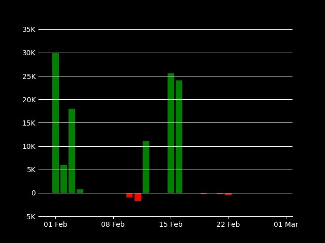

# Bank Account Statement Visualiser

## Installation

```
git clone <repo>
cd <repo>
python -m venv venv
source venv/bin/activate
pip install -r requirements.txt
```

## Help Log

```
usage: main.py [-h] [--account-name] bank accountfile

Quickly view your expenses and earnings from account statement provided by your bank.

positional arguments:
  bank            Your account statement's bank. Current options: SBI, HDFC
  accountfile     Absolute path for your account statement xls file. Download the account statement in excel format from your bank portal and use it here.

optional arguments:
  -h, --help      show this help message and exit
  --account-name  Annotate account name on the plot
```

## Demo Usage

```
python main.py <bank> <csvfile>

Account Name         : Xxxx   
Address              : Xxxx
Account Number       : Xxxx         
Branch               : Xxxx
Start Date           : 01 February 2022    
End Date             : 28 February 2022    
Date Of Download     : 23 March 2022       
Plot has been saved successfully as <bank>--01-Feb--28-Feb.png
```


